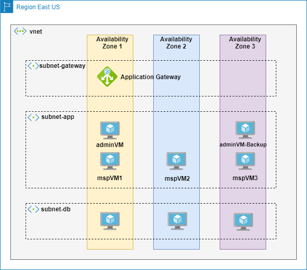

# Create Highly Available Oracle Forms and Reports clusters on Azure

This document guides you to create highly available Oracle Forms and Reports clusters on Azure VMs step by step, including:

- Create Oracle Forms and Reports clusters with 2 replicas.
- Enable Highly Available Administration Server
- Create load balancing with Azure Application Gateway
- Scale up with new Forms and Reports replicas
- Troubleshooting

You will get Forms and Reports running as the picture shows:


This sample does not cover high availability for Oracle Database, you can follow [Oracle HA in Azure- Options](https://techcommunity.microsoft.com/t5/data-architecture-blog/oracle-ha-in-azure-options/ba-p/2281896) to create Oracle Data Guard.

Azure Application Gateways are always deployed in a highly available fashion. You can scale up following [Scaling Application Gateway v2](https://docs.microsoft.com/en-us/azure/application-gateway/application-gateway-autoscaling-zone-redundant).

See network and Availability Zone topology.



## Contents

- [Prerequisites](#prerequisites)
- [Provision Azure WebLogic Virtual Machine](#provision-azure-weblogic-virtual-machine)
- [Create Oracle Database](#create-oracle-database)
- [Create Windows VM and set up XServer](#create-windows-vm-and-set-up-xserver)
- [Install Oracle Fusion Middleware Infrastructure](#install-oracle-fusion-middleware-infrastructure)
- [Install Oracle Forms and Reports](#install-oracle-forms-and-reports)
- [Clone machine for managed servers](#clone-machine-for-managed-servers)
- [Create schemas using RCU](#create-schemas-using-rcu)
- [Configure Virtual IP for Admin Server](#configure-virtual-ip-for-admin-server)
- [Configure Forms and Reports with a new domain](#configure-forms-and-reports-with-a-new-domain)
  - [Create domain configuration](#create-domain-on-adminvm)
  - [Apply domain to managed servers](#create-domain-on-managed-machine)
  - [Create and start Reports components](#create-and-start-reports-components)
  - [Start Forms and Reports](#start-forms-and-reports-managed-servers)
  - [Configure Forms and Reports as Linux service](configure-forms-and-reports-as-a-linux-service)
- [Add Forms and Reports replicas](#add-forms-and-reports-replicas)
  - [Create a new machine for new replicas](#create-a-new-machine-for-new-replicas)
  - [Create and start components](#create-forms-and-reports-components)
  - [Apply domain to the new machine](#apply-domain-to-the-new-machine)
  - [Start new replicas](#start-servers)
- [Create Load Balancing with Azure Application Gateway](#configure-private-application-gateway)
  - [Create Application Gateway](#create-application-gateway)
  - [Configure Backend Pool](#configure-backend-pool)
  - [Configure Health Probe](#configure-health-probe)
- [Enable Highly Available Administration Server](#enable-highly-available-administration-server)
  - [Use a pre-defined backup machine](#use-a-pre-defined-backup-machine)
  - [Use Azure Site Recovery](#use-azure-site-recovery)
- [Validate](#validate)
- [Clean up](#clean-up)
- [Troubleshoot](#troubleshoot)

## Prerequisites

An Azure account with an active subscription. [Create an account for free](https://azure.microsoft.com/free/dotnet).

## Provision Azure WebLogic Virtual Machine

Azure provides a series of Oracle WebLogic base images, it'll save your effort for Oracle tools installation.
This sample will setup Oracle Forms and Reports based on the Azure WebLogic base image, follow the steps to provision a machine with JDK and WebLogic installed:

- Open [Azure portal](https://portal.azure.com/) from your browser.
- Search `WebLogic 12.2.1.4.0 Base Image and JDK8`, you will find the WebLogic offers, select **WebLogic 12.2.1.4.0 Base Image and JDK8 on OL7.6** or **WebLogic Server 12.2.1.4.0 and JDK8 on RHEL7.6**, and click **Create** button.
- Input values in the **Basics** blade:
  - Subscription: select your subscription.
  - Resource group: click **Create new**, input a name.
  - Virtual machine name: `adminVM`
  - Region: East US.
  - Availability options: Availability zone
  - Availability: Zone 1
  - Image: WebLogic Server 12.2.1.4.0 and JDK8 on Oracle Linux 7.6 - Gen1.
  - Size: select a size with more than 8GiB RAM, e.g. Standard B4ms.
  - Authentication type: Password
  - Username: `weblogic`
  - Password: `Secret123456`
- Networking: you are able to bring your own VNET. If no, keep default settings.
- Keep other blades as default. Click **Review + create**.

It will take 10min for the offer completed. After the deployment finishes, you will have a machine with JDK and WLS installed. Then you are able to install and configure Forms and Reports on the top of the machine.

## Create Oracle Database

You are required to have a database to configure the JRF domain for Forms and Reports. This sample uses Oracle Database.
Follow this [document](https://docs.microsoft.com/en-us/azure/virtual-machines/workloads/oracle/oracle-database-quick-create) to create an Oracle database

If you are following the document to create Oracle database, write down the credentials to create domain schema, username and password should be: `sys/OraPasswd1`

## Create Windows VM and set up XServer

Though you have Oracle WebLogic instance running now, to create Oracle Forms and Reports, you still need to install Oracle Forms and Reports.
To simplify the interface, let's provision a Windows machine and leverage XServer to install required tools with graphical user interface.

Follow the steps to provision Windows VM and set up XServer.

- open the resource group.
- Click **Create** button to create a Windows machine.
- Select **Compute**, Select **Virtual machine**.
- Virtual machine name: windowsXServer
- Image: Windows 10 Pro
- Size: Stardard_D2s_v3
- Username: `weblogic`
- Password: `Secret123456`
- Check Licensing.
- Click **Review + create**.

Edit the security to allow access from your terminal.

- Open the resource group that your are working on.
- Select resource `wls-nsg`
- Select **Settings** -> **Inbound security rules**
- Click add
  - Source: Any
  - Destination port ranges: 3389,22
  - Priority: 330
  - Name: Allow_RDP_SSH
  - Click **Save**

After the Windows server is completed, RDP to the server.

- Install the XServer from https://sourceforge.net/projects/vcxsrv/.
- Disable the firewall to allow communication from WebLogic VMs.
  - Turn off Windows Defender Firewall

## Install Oracle Fusion Middleware Infrastructure

Download Oracle Fusion Middleware Infrastructure installer from https://www.oracle.com/webapps/redirect/signon?nexturl=https://download.oracle.com/otn/nt/middleware/12c/122140/fmw_12.2.1.4.0_infrastructure_Disk1_1of1.zip

Unzip the file and copy `fmw_12.2.1.4.0_infrastructure.jar` to **adminVM**.
Make sure `fmw_12.2.1.4.0_infrastructure.jar` is copied to /u01/oracle/fmw_12.2.1.4.0_infrastructure.jar, owner of the file is `oracle`, you can set the ownership with command `chown oracle:oracle /u01/oracle/fmw_12.2.1.4.0_infrastructure.jar`.

Now let's use the XServer to install Oracle Fusion Middleware Infrastructure on **adminVM**.

Steps to install Oracle Fusion Middleware Infrastructure on adminVM:

- RDP to windowsXServer.
- Click XLaunch from the desktop.
  - Multiple windows, Display number: `-1`, click Next.
  - Select "Start no client"
  - Check Clipboard and Primary Selection, Native opengl, Disable access control. Click Next.
  - Click Finish.

- Open CMD
- SSH to adminVM with command `ssh weblogic@adminVM`
- Use root user: `sudo su`
- Install dependencies
  ```
  # dependencies for XServer access
  sudo yum install -y libXtst
  sudo yum install -y libSM
  sudo yum install -y libXrender
  # dependencies for Forms and Reports
  sudo yum install -y compat-libcap1
  sudo yum install -y compat-libstdc++-33
  sudo yum install -y libstdc++-devel
  sudo yum install -y gcc
  sudo yum install -y gcc-c++
  sudo yum install -y ksh
  sudo yum install -y glibc-devel
  sudo yum install -y libaio-devel
  sudo yum install -y motif
  ```
- Disable firewall. If you want to keep the firewall, you must open ports for Reports and Forms.
  ```
  sudo systemctl stop firewalld
  sudo systemctl disable firewalld
  ```
- Create directory for user data
  ```
  mkdir /u02
  chown oracle:oracle /u02
  ```
- Use `oracle` user: `sudo su - oracle`
- Get the private IP address of widnowsXServer, e.g. `10.0.0.8`
- Set env variable: `export DISPLAY=<yourWindowsVMVNetInternalIpAddress>:0.0`, e.g. `export DISPLAY=10.0.0.8:0.0`
- Set Java env: 
  ```
  oracleHome=/u01/app/wls/install/oracle/middleware/oracle_home
  . $oracleHome/oracle_common/common/bin/setWlstEnv.sh
  ```
- Install fmw_12.2.1.4.0_infrastructure.jar, if you run into **ERROR: Temporary directory /tmp does not have enough free space.**, see [Troubleshoot#4](#troubleshoot)
  - Launch the installer
    ```
    java -jar fmw_12.2.1.4.0_infrastructure.jar
    ```
  - Continue? Y
  - Page1
    - Inventory Directory: `/u01/oracle/oraInventory`
    - Operating System Group: `oracle`
  - Step 3
    - Oracle Home: `/u01/app/wls/install/oracle/middleware/oracle_home`
  - Step 4
    - Select "Function Middleware infrastructure"
  - Installation summary
    - picture resources\images\screenshot-ofm-installation-summary.png
  - The process should be completed without errors.
  - Remove the installation file to save space: `rm fmw_12.2.1.4.0_infrastructure.jar`

## Install Oracle Forms and Reports

Following the steps to install Oracle Forms and Reports:
- Download wget.sh from https://www.oracle.com/middleware/technologies/forms/downloads.html#
  - Oracle Fusion Middleware 12c (12.2.1.4.0) Forms and Reports for Linux x86-64 for (Linux x86-64)
  - Oracle Fusion Middleware 12c (12.2.1.4.0) Forms and Reports for Linux x86-64 for (Linux x86-64)
- Copy the wget.sh to `/u01/oracle/wget.sh`
- Use the windowsXServer ssh to adminVM: `ssh weblogic@adminVM`.
- Use `oracle` user
- Set env variable: `export DISPLAY=<yourWindowsVMVNetInternalIpAddress>:0.0`, e.g. `export DISPLAY=10.0.0.8:0.0`
- Edit wget.sh, replace `--ask-password` with `--password <your-sso-password>`
- Run the script, it will download the installer.
  - `bash wget.sh`
  - input your SSO account name.
- Unzip the zip files: ` unzip "*.zip"`, you will get `fmw_12.2.1.4.0_fr_linux64.bin` and `fmw_12.2.1.4.0_fr_linux64-2.zip`
- Remove the zip files to save space
  ```
   rm V983392-01_1of2.zip
   rm V983392-01_2of2.zip
  ```
- Install Forms: `./fmw_12.2.1.4.0_fr_linux64.bin`
  - The installation dialog should prompt up, if no, set `export PS1="\$"`, run `./fmw_12.2.1.4.0_fr_linux64.bin` again.
  - Inventory Directory: `/u01/oracle/oraInventory`
  - Operating System Group: `oracle`
  - Step 3:
    - Oracle Home: `/u01/app/wls/install/oracle/middleware/oracle_home`
  - Step 4:
    - Forms and Reports Deployment
  - Step 5:
    - JDK Home: `/u01/app/jdk/jdk1.8.0_291`
  - Step 6: you may get dependencies error, you must install the corresponding package and run `./fmw_12.2.1.4.0_fr_linux64.bin` again.
    - Error like "Checking for compat-libcap1-1.10;Not found", then run `sudo yum install compat-libcap1` to install the `compat-libcap1` package.
  - The installation should be completed without errors.

Now you have Forms and Reports installed in the adminVM. Let's clone the machine for managed servers.

## Clone machine for managed servers

You have Oracle Forms and Reports installed in the adminVM, you are able to reuse the installation by cloning adminVM for managed servers.

Follow the steps to clone adminVM, for high availability, let's create the disk and machine in different zones as the table shows:

| Index | Machine Name | Disk Name | Availability Zone |
|----------|----------|----------|----------|
| 1 | mspVM1 | mspVM1_OS_Disk | Zone 1 |
| 2 | mspVM2 | mspVM2_OS_Disk | Zone 2 |
| 3 | mspVM3 | mspVM3_OS_Disk | Zone 3 |

Create a snapshot from adminVM OS disk. If you have snapshot of adminVM, skip the following two steps:

- Open Azure portal, stop adminVM.
- Create a snapshot from OS disk.

Keep the snapshot, you will use it for scaling.

Create VMs for Forms and Reports replicas based on the snapshot:

1. Create a disk from the snapshot.
2. Create a VM with your expected name, e.g. `mspVM1` on the disk. Make sure you are selecting the right availability zone, see above table.
3. SSH to the machine, use `root` user and change the hostname.
    - Set hostname with `hostnamectl set-hostname hostname`. For example, set hostname mspVM1 with command `hostnamectl set-hostname mspVM1`
4. Repeat step1-3 for `mspVM2` or another new machine, make sure you have set correct hostname.

For the initial setup, make sure you have three machine ready to configure Forms and Reports: **adminVM**, **mspVM1**, **mspVM2**, and move on with next section.

For new replicas, make sure you have the new machine ready, and continue from [Create Forms and Reports components](#create-forms-and-reports-components).

## Create schemas using RCU

You are required to create the schemas for the WebLogic domain.  
The following steps leverage XServer and RCU to create schemas on the Oracle database created previously.

- Use the windowsXServer.
- SSH to adminVM
- Use `oracle` user
- Set env variable: `export DISPLAY=<yourWindowsVMVNetInternalIpAddress>:0.0`, e.g. `export DISPLAY=10.0.0.8:0.0`
- `bash /u01/app/wls/install/oracle/middleware/oracle_home/oracle_common/bin/rcu`
- Step2: Create Repository -> System Load and Product Load
- Step3: Input the connection information of Oracle database.
- Step4: please note down the prefix, which will be used in the following configuration, this sample uses `DEV0402`.
  - STB
  - OPSS
  - IAU
  - IAU_APPEND
  - IAU_VIEWER
  - MDS
  - WLS
- Step5: Use same passwords for all schemas. Value: `Secret123456`
  - Note: you must use the same password of WebLogic admin account.
- The schema should be completed without error.

## Configure Virtual IP for Admin Server

We will use a secondary virtual IP address for the Admin Server, rather than using the primary IP address of adminVM, which makes the Admin Server more flexible for backup and failover. To enable the secondary IP address, you are required to make changes to:

1. Infrastructure: add a secondary IP to the Azure Network Interface of adminVM.
2. Virtual Machine: add a local ethernet connection and restart networking service.
3. Node manager: configure node manager to listen the new IP address and start the node manager with the IP address.
4. Admin Server: configure Admin Server to listen the new IP address and restart Admin Server.

Make sure you have at least one available private IP address that hasn't been used by other machine, this sample use `10.0.0.16`. You can find more information from this [document](https://docs.microsoft.com/en-us/azure/virtual-network/ip-services/virtual-network-multiple-ip-addresses-portal?context=/azure/virtual-machines/context/context).

- Go to Azure Portal, Open adminVM
- Select Settings -> Networking and open the network interface.
- Select Settings -> IP Configurations -> Add
  - Name: ipconfig2
  - Allocation: Static
  - IP Address: your available private IP address, here uses `10.0.0.16`
  - Public IP: Disassociate

Now you have added the IP address to the external network interface of adminVM, to connect adminVM with it, you still need to enable local ethernet connection on the machine.

You have to login to adminVM and configure the ethernet connection.

- SSH to adminVM, use `root` user
- Add ethernet connection. Replace the IP address with yours and run the following command to add `ifcfg-eth0:1`.

```shell
secondaryIP="10.0.0.16"
cd /etc/sysconfig/network-scripts
ls ifcfg-*
touch ifcfg-eth0:1
vi ifcfg-eth0:1

cat <<EOF >ifcfg-eth0:1
DEVICE=eth0:1
BOOTPROTO=static
ONBOOT=yes
IPADDR=${secondaryIP}
NETMASK=255.255.255.0
EOF
```

- Restart network service with command `/etc/init.d/network restart`
- Validate configuration, run `ifconfig`, you should find there is a network interface listening to the IP address like:

```text
[root@adminVM1 network-scripts]# ifconfig
eth0: flags=4163<UP,BROADCAST,RUNNING,MULTICAST>  mtu 1500
        inet 10.0.0.4  netmask 255.255.255.0  broadcast 10.0.0.255
        inet6 fe80::20d:3aff:fe8f:1fe7  prefixlen 64  scopeid 0x20<link>
        ether 00:0d:3a:8f:1f:e7  txqueuelen 1000  (Ethernet)
        RX packets 104754  bytes 69209518 (66.0 MiB)
        RX errors 0  dropped 0  overruns 0  frame 0
        TX packets 75892  bytes 19074850 (18.1 MiB)
        TX errors 0  dropped 0 overruns 0  carrier 0  collisions 0

eth0:0: flags=4163<UP,BROADCAST,RUNNING,MULTICAST>  mtu 1500
        inet 10.0.0.15  netmask 255.255.255.0  broadcast 10.0.0.255
        ether 00:0d:3a:8f:1f:e7  txqueuelen 1000  (Ethernet)
```

## Configure Forms and Reports with a new domain

### Create domain on adminVM

Now, the machine and database are ready, let's move on to create a new domain for Forms and Reports.

- Use the windowsXServer.
- SSH to adminVM
- Use `oracle` user
- Set env variable: `export DISPLAY=<yourWindowsVMVNetInternalIpAddress>:0.0`, e.g. `export DISPLAY=10.0.0.8:0.0`
- `bash  /u01/app/wls/install/oracle/middleware/oracle_home/oracle_common/common/bin/config.sh`
- Page1:
  - Create a new domain
  - Location: `/u02/domains/wlsd`
- Page2: 
  - FADS
  - Oracle Forms
  - Oracle Reports Application
  - Oracle Enterprise Manager
  - Oracle Reports Tools
  - Oracle Reports Server
  - Oracle Reports Bridge
  - Oracle WSM Policy Manager
  - Oracle JRF
  - ORacle WebLogic Coherence Cluster Extension
- Page3: Applciation Location
  - Location: `/u02/applications/wlsd`
- Page4: Administrator account
  - Name: `weblogic`
  - Password: `Secret123456`, **make sure the value is the same with schema password**.
- Page5: Domain mode and JDK
  - Domain mode: production
  - JDK: keep default
- Page6: 
  - RCU Data
  - Host Name: the host name of database
  - DBMS/Service: your dbms
  - Schema Owner is `<the-rcu-schema-prefix>_STB`, this sample uses `DEV0402_STB`
  - Schema Password: `Secret123456`
- Page9: Advanced Configuration
  - Administration Server
  - Node Manager
  - Topology
  - System Components
  - Deployment and Services
- Page10: Administration Server
  - Server Name: `admin`
  - Listen Address: the virtual IP address created in [Configure Virtual IP for Admin Server](#configure-virtual-ip-for-admin-server)
  - Listen Port: 7001
  - Server Groups: WSMPM-MAN-SVR
- Page11: Node Manager
  - Node Manager credentials
    - Username: `weblogic`
    - Password: `Secret123456`
- Page12: Managed Servers, add the following servers
  - WLS_FORMS1
    - Listen address: private IP of mspVM1
    - Port: 9001
    - Server Groups: FORMS_MAN_SVR
  - WLS_REPORTS1
    - Listen address: private IP of mspVM1
    - Port: 9002
    - Server Groups: REPORTS_APP_SVR
  - WLS_FORMS2
    - Listen address: private IP of mspVM2
    - Port: 9001
    - Server Groups: FORMS_MAN_SVR
  - WLS_REPORTS2
    - Listen address: private IP of mspVM2
    - Port: 9002
    - Server Groups: REPORTS_APP_SVR
- Page13: CLusters
  - Keep default
- Page14: Server Templates
  - Keep default
- Page15: Dynamic Clusters
  - Keep default
- Page16: Assign Servers to Clusters
  - cluster_forms
    - WLS_FORMS1
    - WLS_FORMS2
  - cluster_reports
    - WLS_REPORTS1
    - WLS_REPORTS2
- Page17: Coherence Cluster
  - Keep default
- Page18: Machines
  - adminVM, the virtual IP address created in [Configure Virtual IP for Admin Server](#configure-virtual-ip-for-admin-server), 5556
  - mspVM1, `<private-ip-of-mspVM1>`, 5556
  - mspVM2, `<private-ip-of-mspVM2>`, 5556
- Page19: Assign Servers to machine
  - adminVM
    - admin
  - mspVM1
    - WLS_FORMS1
    - WLS_REPORTS1
  - mspVM2
    - WLS_FORMS2
    - WLS_REPORTS2
- Page20: virtual targets
  - Keep default
- Page21: Partitions
  - Keep default
- Page22: System Components
  - forms1, FORMS, 3600, 0
  - forms2, FORMS, 3600, 0
- Page22: Assign System Component
  - mspVM1
    - SystemComonent
      - forms1
  - mspVM2
    - SystemComonent
      - forms2
- Page20: Deployments Targeting
  - AdminServer
    - admin
      - Keep Default
  - Cluster
    - cluster_forms
      - AppDeployment
        - DMS Application#12.2.1.1.0
        - coherence-transaction-rar
        - formsapp#12.2.1
        - state-management-provider-memory-rar
        - wsm-pm
      - Libraries
        <details>
        <summary>Libraries</summary>
        <p>
        - UIX (11,12.2.1.3.0) <br>
        - adf.oracle.businesseditor (1.0,12.2.1.3.0) <br>
        - adf.oracle.domain (1.0,12.2.1.3.0) <br>
        - adf.oracle.domain.groovy (1.0,12.2.1.3.0) <br>
        - adf.oracle.domain.webapp (1.0,12.2.1.3.0) <br>
        - adf.oracle.domain.webapp.antlr-runtime (1.0,12.2.1.3.0) <br>
        - adf.oracle.domain.webapp.apache.httpclient (1.0,12.2.1.3.0) <br>
        - adf.oracle.domain.webapp.apache.httpclient-cache (1.0,12.2.1.3.0) <br>
        - adf.oracle.domain.webapp.apache.httpcore (1.0,12.2.1.3.0) <br>
        - adf.oracle.domain.webapp.apache.httpmime (1.0,12.2.1.3.0) <br>
        - adf.oracle.domain.webapp.apache.velocity (1.0,12.2.1.3.0) <br>
        - adf.oracle.domain.webapp.batik-bundle (1.0,12.2.1.3.0) <br>
        - adf.oracle.domain.webapp.guava (1.0,12.2.1.3.0) <br>
        - adf.oracle.domain.webapp.xml-apis-ext (1.0,12.2.1.3.0) <br>
        - jsf (2.0,1.0.0.0_2-2-8) <br>
        - jstl (1.2,1.2.0.1) <br>
        - odl.clickhistory (1.0,12.2.1) <br>
        - odl.clickhistory.webapp (1.0,12.2.1) <br>
        - ohw-rcf (5,12.2.1.3.0) <br>
        - ohw-uix (5,12.2.1.3.0) <br>
        - oracle.adf.dconfigbeans (1.0,12.2.1.3.0) <br>
        - oracle.adf.desktopintegration (1.0,12.2.1.3.0) <br>
        - oracle.adf.desktopintegration.model (1.0,12.2.1.3.0) <br>
        - oracle.adf.management (1.0,12.2.1.3.0) <br>
        - oracle.bi.adf.model.slib (1.0,12.2.1.3.0) <br>
        - oracle.bi.adf.view.slib (1.0,12.2.1.3.0) <br>
        - oracle.bi.adf.webcenter.slib (1.0,12.2.1.3.0) <br>
        - oracle.bi.composer (11.1.1,0.1) <br>
        - oracle.bi.jbips (11.1.1,0.1) <br>
        - oracle.dconfig-infra (2.0,12.2.1) <br>
        - oracle.formsapp.dependencieslib (12.2.1,12.2.1) <br>
        - oracle.jrf.system.filter <br>
        - oracle.jsp.next (12.2.1,12.2.1) <br>
        - oracle.pwdgen (2.0,12.2.1) <br>
        - oracle.sdp.client (2.0,12.2.1.3.0) <br>
        - oracle.sdp.messaging (2.0,12.2.1.3.0) <br>
        - oracle.wsm.idmrest.sharedlib (1.0,12.2.1.3) <br>
        - oracle.wsm.seedpolicies (2.0,12.2.1.3) <br>
        - orai18n-adf (11,11.1.1.1.0) <br>
        - owasp.esapi (2.0,12.2.1) <br>
        </p>
        </details>
    - clusters_reports
      - AppDeployment
        - DMS Application#12.2.1.1.0
        - coherence-transaction-rar
        - reports#12.2.1
        - state-management-provider-memory-rar
        - wsm-pm
      - Libraries
        <details><summary>Libraries</summary><p>
        - UIX (11,12.2.1.3.0) <br>
        - adf.oracle.businesseditor (1.0,12.2.1.3.0) <br>
        - adf.oracle.domain (1.0,12.2.1.3.0) <br>
        - adf.oracle.domain.groovy (1.0,12.2.1.3.0) <br>
        - adf.oracle.domain.webapp (1.0,12.2.1.3.0) <br>
        - adf.oracle.domain.webapp.antlr-runtime (1.0,12.2.1.3.0) <br>
        - adf.oracle.domain.webapp.apache.httpclient (1.0,12.2.1.3.0) <br>
        - adf.oracle.domain.webapp.apache.httpclient-cache (1.0,12.2.1.3.0) <br>
        - adf.oracle.domain.webapp.apache.httpcore (1.0,12.2.1.3.0) <br>
        - adf.oracle.domain.webapp.apache.httpmime (1.0,12.2.1.3.0) <br>
        - adf.oracle.domain.webapp.apache.velocity (1.0,12.2.1.3.0) <br>
        - adf.oracle.domain.webapp.batik-bundle (1.0,12.2.1.3.0) <br>
        - adf.oracle.domain.webapp.guava (1.0,12.2.1.3.0) <br>
        - adf.oracle.domain.webapp.xml-apis-ext (1.0,12.2.1.3.0) <br>
        - jsf (2.0,1.0.0.0_2-2-8) <br>
        - jstl (1.2,1.2.0.1) <br>
        - odl.clickhistory (1.0,12.2.1) <br>
        - odl.clickhistory.webapp (1.0,12.2.1) <br>
        - ohw-rcf (5,12.2.1.3.0) <br>
        - ohw-uix (5,12.2.1.3.0) <br>
        - oracle.adf.dconfigbeans (1.0,12.2.1.3.0) <br>
        - oracle.adf.desktopintegration (1.0,12.2.1.3.0) <br>
        - oracle.adf.desktopintegration.model (1.0,12.2.1.3.0) <br>
        - oracle.adf.management (1.0,12.2.1.3.0) <br>
        - oracle.bi.adf.model.slib (1.0,12.2.1.3.0) <br>
        - oracle.bi.adf.view.slib (1.0,12.2.1.3.0) <br>
        - oracle.bi.adf.webcenter.slib (1.0,12.2.1.3.0) <br>
        - oracle.bi.composer (11.1.1,0.1) <br>
        - oracle.bi.jbips (11.1.1,0.1) <br>
        - oracle.dconfig-infra (2.0,12.2.1) <br>
        - oracle.jrf.system.filter <br>
        - oracle.jsp.next (12.2.1,12.2.1) <br>
        - oracle.pwdgen (2.0,12.2.1) <br>
        - oracle.reports.applib (12.2.1,12.2.1) <br>
        - oracle.sdp.client (2.0,12.2.1.3.0) <br>
        - oracle.sdp.messaging (2.0,12.2.1.3.0) <br>
        - oracle.wsm.idmrest.sharedlib (1.0,12.2.1.3) <br>
        - oracle.wsm.seedpolicies (2.0,12.2.1.3) <br>
        - orai18n-adf (11,11.1.1.1.0) <br>
        - owasp.esapi (2.0,12.2.1) <br>
        </p></details>
- Page21: Services Targeting
  - AdminServer
    - admin
      - JDBCSystemResource
        - LocalSvcTblDataSource
        - WLSSchemaDataSource
        - mds-owsm
        - opss-audit-DBDS
        - opss-audit-viewDS
        - opss-data-source
      - ShutdownClass
        - DMSShutDown
      - StartupClass
        - AWT Applciation Context Startup Class
        - DMS-Startup
        - JRF Startup Class
        - ODL-Startup
        - WSM Startup Class
        - Web Services Startup Class
      - WLDFSystemResource
        - Module-FMDFW
  - Cluster
    - cluster_forms
      - JDBCSystemResource
        - opss-audit-DBDS
        - opss-audit-viewDS
        - opss-data-source
      - ShutdownClass
        - DMSShutDown
      - StartupClass
        - AWT Applciation Context Startup Class
        - DMS-Startup
        - JRF Startup Class
        - ODL-Startup
        - WSM Startup Class
        - Web Services Startup Class
      - WLDFSystemResource
        - Module-FMDFW
    - cluster_reports
      - JDBCSystemResource
        - opss-audit-DBDS
        - opss-audit-viewDS
        - opss-data-source
      - ShutdownClass
        - DMSShutDown
      - StartupClass
        - AWT Applciation Context Startup Class
        - DMS-Startup
        - JRF Startup Class
        - ODL-Startup
        - WSM Startup Class
        - Web Services Startup Class
      - WLDFSystemResource
        - Module-FMDFW
- The process should be completed without error.
- Pack the domain and copy the domain configuration to managed machines.

  ```shell
  rm /tmp/cluster.jar -f
  cd /u01/app/wls/install/oracle/middleware/oracle_home/oracle_common/common/bin
  bash pack.sh -domain=/u02/domains/wlsd -managed=true -template=/tmp/cluster.jar -template_name="ofrwlsd"
  ```

  ```shell
  scp /tmp/cluster.jar weblogic@mspVM1:/tmp/cluster.jar

  scp /tmp/cluster.jar weblogic@mspVM2:/tmp/cluster.jar
  ```

- Exit `oracle` user: `exit`
- Use root user: `sudo su`
- Create service for node manager and Admin Server
  - Create service for Admin Server   
    Let's create the credentials for weblogic account.

    ```shell
    mkdir -p /u02/domains/wlsd/servers/admin/security
    cat <<EOF >/u02/domains/wlsd/servers/admin/security/boot.properties
    username=weblogic
    password=Secret123456
    EOF
    ```

    ```shell
    cat <<EOF >/etc/systemd/system/wls_admin.service
    [Unit]
    Description=WebLogic Adminserver service
    After=network-online.target
    Wants=network-online.target
    
    [Service]
    Type=simple
    WorkingDirectory="/u02/domains/wlsd"
    ExecStart="/u02/domains/wlsd/startWebLogic.sh"
    ExecStop="/u02/domains/wlsd/bin/stopWebLogic.sh"
    User=oracle
    Group=oracle
    KillMode=process
    LimitNOFILE=65535
    Restart=always
    RestartSec=3
    
    [Install]
    WantedBy=multi-user.target
    EOF
    ```

  - Create service for node manager

    ```bash
    cat <<EOF >/etc/systemd/system/wls_nodemanager.service
    [Unit]
    Description=WebLogic nodemanager service
    After=network-online.target
    Wants=network-online.target
    [Service]
    Type=simple
    # Note that the following three parameters should be changed to the correct paths
    # on your own system
    WorkingDirectory="/u02/domains/wlsd"
    ExecStart="/u02/domains/wlsd/bin/startNodeManager.sh"
    ExecStop="/u02/domains/wlsd/bin/stopNodeManager.sh"
    User=oracle
    Group=oracle
    KillMode=process
    LimitNOFILE=65535
    Restart=always
    RestartSec=3
    [Install]
    WantedBy=multi-user.target
    EOF
    ```

- Start node manager and Admin Server, it takes about 10 min for Admin Server up.

  ```shell
  sudo systemctl enable wls_nodemanager
  sudo systemctl enable wls_admin
  sudo systemctl daemon-reload
  sudo systemctl start wls_nodemanager
  sudo systemctl start wls_admin
  ```

Now you are able to access admin console with `http://adminserver-ip:7001/console`, and Enterprise Manager with `http://adminserver-ip:7001/em`.

### Create domain on managed machine

Now, you have Forms and Reports configured in adminVM, let's apply the domain on mspVM1 and mspVM2.

You can also follow the steps to apply domain to a new machine for new replicas.

Configure domain on managed machine:

1. SSH to your machine, e.g login to mspVM1 with command `ssh weblogic@mspVM1`
1. Use `root` user to set the ownership of domain package

  ```shell
  sudo su
  chown oracle:oracle /tmp/cluster.jar
  ```

1. Use `oracle` user, `sudo su - oracle`
1. Unpack the domain

  ```shell
  cd /u01/app/wls/install/oracle/middleware/oracle_home/oracle_common/common/bin
  bash unpack.sh -domain=/u02/domains/wlsd -template=/tmp/cluster.jar 
  ```

1. Make sure the node manager listen address is correct by `cat /u02/domains/wlsd/nodemanager/nodemanager.properties`. The listen address should be private IP of the machine.
1. Exit oracle user with command `exit`
1. Use root user: `sudo su`
1. Create service for node manager

  ```shell
  cat <<EOF >/etc/systemd/system/wls_nodemanager.service
  [Unit]
  Description=WebLogic nodemanager service
  After=network-online.target
  Wants=network-online.target
  [Service]
  Type=simple
  # Note that the following three parameters should be changed to the correct paths
  # on your own system
  WorkingDirectory="/u02/domains/wlsd"
  ExecStart="/u02/domains/wlsd/bin/startNodeManager.sh"
  ExecStop="/u02/domains/wlsd/bin/stopNodeManager.sh"
  User=oracle
  Group=oracle
  KillMode=process
  LimitNOFILE=65535
  Restart=always
  RestartSec=3
  [Install]
  WantedBy=multi-user.target
  EOF
  ```

1. Start node manager

  ```shell
  sudo systemctl enable wls_nodemanager
  sudo systemctl daemon-reload
  sudo systemctl start wls_nodemanager
  ```

For initial setup, apply step 1-8 to mspVM2, and continue from [Create and start Reports components](#create-and-start-reports-components).
For new replicas, apply step 1-8 to your new machines, and continue from [Create and start Reports tools for new replicas](#create-and-start-reports-tools).

### Create and start Reports components

Now, you have node manager running on adminVM, mspVM1, mspVM2, and Admin Server up in adminVM.   
To successfully start Reports server, you must create and start the Reports components.

Let's create the ReportsToolsComponent using WLST.

- SSH to adminVM: `ssh weblogic@adminvm`
- Use `oracle` user: `sudo su - oracle`
- Use WLST to create Reports tools instance.

  ```
  cd /u01/app/wls/install/oracle/middleware/oracle_home/oracle_common/common/bin
  ./wlst.sh

  # connect Admin Server, replace adminserver-ip with the real value.
  connect("weblogic","Secret123456", "adminserver-ip:7001")

  createReportsToolsInstance(instanceName='reptools1', machine='mspVM1')
  createReportsToolsInstance(instanceName='reptools2', machine='mspVM2')

  # exit WLST
  exit()
  ```

  Those commands should be finished without error. You have to resolve error before moving on.
- Start Reports tools.

  ```shell
  cd /u02/domains/wlsd/bin
  # the commands require you to input password of node manager.
  ./startComponent.sh reptools1
  ./startComponent.sh reptools2
  ```

  The Reports tools should start successfully.

### Start Forms and Reports managed servers

Now, you have Reports tools components created and running, you are able to start the managed server and start the Reports In-process server.

- Login admin console: http://adminserver-ip:7001/console
- Select Environment -> Servers -> Control
- Start WLS_FORMS1, WLS_FORMS2, WLS_REPORTS1 and WLS_REPORTS2.
- The servers should be running.

Now you are able to start Reports in process server from browser.

- Start reports server on mspVM1 with the URL
  - `http://<mspVM1-ip>:9002/reports/rwservlet/startserver`
  - You will get output `1|0` from the browser if the server is up.
- Start reports server on mspVM2 with the URL
  - `http://<mspVM2-ip>:9002/reports/rwservlet/startserver`
  - You will get output `1|0` from the browser if the server is up.


### Configure Forms and Reports as a Linux service

Now, you have the Froms and Reports running on your managed machines. To start them automactically when the machine is rebooted, you are able to configure them as Linux service.

Please note that, as Forms and Reports are running on managed nodes, no change needed for adminVM. 

Orders to start Froms and Reports:

- Start node manager. We have created service `wls_nodemanager` to start node manager.
- Start managed servers for Forms, they are `WLS_FORMS1` on mspVM1 and `WLS_FORMS2` on mspVM2, or `WLS_FORMSN` on mspVMN for new replicas.
- Start managed servers for Reports, they are `WLS_REPORTS1` on mspVM1 and `WLS_REPORTS2` on mspVM2, or `WLS_REPORTSN` on mspVMN for new replicas.

The following WLST script is to `WLS_FORMS1`, `WLS_REPORTS1` on mspVM1. 
Change the user name `WLS_USER`, passowrd `WLS_PSWD` and `ADMIN_SERVER_ADDRESS` with the virtual IP address created in [Configure Virtual IP for Admin Server](#configure-virtual-ip-for-admin-server), here is 10.0.0.16.
To create the script on mspVM2 and new replicas, change `FORMS_SERVER_NAME`, `REPORTS_SERVER_NAME` and `MSPVM_ADDRESS` with corresponding values.

Swith to `oracle` with `sudo su - oracle` and create script.

```bash
WLS_USER=weblogic
WLS_PSWD=Secret123456
ADMIN_SERVER_ADDRESS=10.0.0.16
FORMS_SERVER_NAME=WLS_FORMS1
REPORT_SERVER_NAME=WLS_REPORTS1
DOMAIN_HOME_PATH=/u02/domains/wlsd
INSTALL_PATH=/u01/app/wls/install
MSPVM_ADDRESS=10.0.0.6

cat <<EOF > $DOMAIN_HOME_PATH/startFormsReports.py 
import os, sys
connect('${WLS_USER}','${WLS_PSWD}','${ADMIN_SERVER_ADDRESS}:7001')
domainRuntime()
cd("/ServerLifeCycleRuntimes/${FORMS_SERVER_NAME}")
status=cmo.getState()
if status != "RUNNING":
  start('${FORMS_SERVER_NAME}','Server')
else:
  print 'Forms ${FORMS_SERVER_NAME} is already running'

cd("/ServerLifeCycleRuntimes/${REPORT_SERVER_NAME}")
status=cmo.getState()
if status != "RUNNING":
  start('${REPORT_SERVER_NAME}','Server')
else:
  print 'Reports ${REPORT_SERVER_NAME} is already running'

disconnect()
EOF

cat <<EOF >$DOMAIN_HOME_PATH/startFormsReports.sh
${INSTALL_PATH}/oracle/middleware/oracle_home/oracle_common/common/bin/wlst.sh $DOMAIN_HOME_PATH/startFormsReports.py > /dev/null 2>&1 &

echo Wait for Reports server ready

code="404"
while [ "\${code}" != "200" ]
do
  code=\$(curl -s -o /dev/null -w "%{http_code}" http://${MSPVM_ADDRESS}:9002/reports/)
  echo "http code: \${code}."
  sleep 2
done

echo Start Reports In-process server
curl http://${MSPVM_ADDRESS}:9002/reports/rwservlet/startserver > /dev/null 2>&1 &
echo Done!
EOF
```

The following WLST script is to stop `WLS_FORMS1`, `WLS_REPORTS1` on mspVM1. 
Change the user name `WLS_USER`, passowrd `WLS_PSWD` and `ADMIN_SERVER_ADDRESS` with the virtual IP address created in [Configure Virtual IP for Admin Server](#configure-virtual-ip-for-admin-server), here is 10.0.0.16.
To create the script on mspVM2 and new replicas, change `FORMS_SERVER_NAME` and `REPORTS_SERVER_NAME` with corresponding values.

```bash
WLS_USER=weblogic
WLS_PSWD=Secret123456
ADMIN_SERVER_ADDRESS=10.0.0.16
FORMS_SERVER_NAME=WLS_FORMS1
REPORT_SERVER_NAME=WLS_REPORTS1
DOMAIN_HOME_PATH=/u02/domains/wlsd

cat <<EOF > $DOMAIN_HOME_PATH/stopFormsReports.py 
import os, sys
connect('${WLS_USER}','${WLS_PSWD}','${ADMIN_SERVER_ADDRESS}:7001')
shutdown('${FORMS_SERVER_NAME}','Server')
shutdown('${REPORT_SERVER_NAME}','Server')

disconnect()
EOF

cat <<EOF >$DOMAIN_HOME_PATH/stopFormsReports.sh
${INSTALL_PATH}/oracle/middleware/oracle_home/oracle_common/common/bin/wlst.sh $DOMAIN_HOME_PATH/stopFormsReports.py > /dev/null 2>&1 &
echo Done!
EOF
```

Now, swith to `root` user with command `exit`, create and enable the service.

```bash
DOMAIN_HOME_PATH=/u02/domains/wlsd
cat <<EOF >/etc/systemd/system/ofmw.service
[Unit]
Description=Oracle Fusion Middleware Forms and Reports 12c
After=wls_nodemanager.service
Wants=wls_nodemanager.service
[Service]
Type=oneshot
RemainAfterExit=true
WorkingDirectory="/u02/domains/wlsd"
ExecStart="$DOMAIN_HOME_PATH/startFormsReports.sh"
ExecStop="$DOMAIN_HOME_PATH/stopFormsReports.sh"
User=oracle
Group=oracle
KillMode=process
LimitNOFILE=65535
[Install]
WantedBy=multi-user.target
EOF
```


```bash
sudo systemctl enable ofmw.service
sudo systemctl daemon-reload
sudo systemctl start ofmw.service
```

## Add Forms and Reports replicas

You are able to add Forms and Reports replicas by cloning machine and starting the corresponding components.

### Create a new machine for new replicas

Clone adminVM following [Clone machine for managed servers](#clone-machine-for-managed-servers), let's name the new machine with `mspVM3`.

### Create managed servers and Forms component

Firstly, you are required to create and start replated components. This sample leverages WLST offline mode to update the existing domain with new machine, new managed servers and new component, which requires restart on Admin Server to cause changes working.

This is an example to update the existing domain to start Forms and Reports on mspVM3, replace the machine name and component name with yours.

Use WLST to add new replicas:

- SSH to adminVM and switch to root user
- Stop Admin Server:

  ```shell
  sudo systemctl stop wls_admin
  kill -9 `ps -ef | grep 'Dweblogic.Name=admin' | grep -v grep | awk '{print $2}'`
  ```

- Switch to `oracle` user: `sudo su - oracle`
- Prepare Python script to create machine, managed servers and Forms component, modify the the value of Shell variables.

  ```shell
  # Modify the value of variables with yours.
  # Keep the index value the same with Azure Virtual Machine index
  index=3
  # Private IP address of the new machine
  vmIP="10.0.0.8"
  # Machine name
  vmName="mspVM${index}"
  # New Forms managed server name
  formsSvrName="WLS_FORMS${index}"
  # New Forms system component name
  formsSysCompName="forms${index}"
  # New Reports managed server name
  reportsSvrName="WLS_REPORTS${index}"
  cat <<EOF >create-forms3.py
  import sys, traceback
  vmIp="${vmIP}"
  vmName="${vmName}"
  formsSvrName="${formsSvrName}"
  formsSysCompName="${formsSysCompName}"
  reportsSvrName="${reportsSvrName}"
  formsSvrGrp=["FORMS-MAN-SVR"]
  reportsSvrGrp=["REPORTS-APP-SERVERS"]

  readDomain('/u02/domains/wlsd')
  print('\nCreate Machine ')
  cd('/')
  create(vmName,'Machine')
  cd('Machine/'+vmName)
  create(vmName,'NodeManager')
  cd('NodeManager/'+vmName)
  set('ListenAddress',vmIp)
  print('\nCreate ' + formsSvrName)
  cd('/')
  create(formsSvrName, 'Server')
  cd('/Servers/'+formsSvrName)
  set('ListenAddress',vmIp)
  set('ListenPort',int('9001'))
  set('Machine',vmName)
  cd('/')
  assign('Server',formsSvrName,'Cluster','cluster_forms')
  cd('/')
  setServerGroups(formsSvrName, formsSvrGrp)
  print('\nCreate '+ reportsSvrName)
  cd('/')
  create(reportsSvrName, 'Server')
  cd('/Servers/'+ reportsSvrName)
  set('ListenAddress',vmIp)
  set('ListenPort',int('9002'))
  set('Machine',vmName)
  cd('/')
  assign('Server',reportsSvrName,'Cluster','cluster_reports')
  cd('/')
  setServerGroups(reportsSvrName, reportsSvrGrp)
  print('\nCreate FORMS SystemComponent '+formsSysCompName)
  cd('/')
  create(formsSysCompName, 'SystemComponent')
  cd('/SystemComponent/'+formsSysCompName)
  cmo.setComponentType('FORMS')
  set('Machine', vmName)
  updateDomain()
  closeDomain()
  EOF
  ```

- Run the script with WLST offline mode, the script should be completed without errors.

  ```shell
  /u01/app/wls/install/oracle/middleware/oracle_home/oracle_common/common/bin/wlst.sh create-forms3.py
  ```

- Restart the domain and Admin Server to cause changes happen. It takes about 10 min for the Admin Server up.

  ```shell
  sudo systemctl start wls_admin
  ```

  Access http://adminserver-ip:7001/console from browser to make sure the Admin Server is up.

### Apply domain to the new machine

Now, you have finished updating the domain. Let's pack the domain and apply the domain to new machine.

- Pack the domain on adminVM:
  - SSH to adminVM: `ssh weblogic@adminVM`
  - Use oracle user: `sudo su - oracle`
  - Pack the domain
  
    ```shell
    rm /tmp/cluster.jar -f
    cd /u01/app/wls/install/oracle/middleware/oracle_home/oracle_common/common/bin
    bash pack.sh -domain=/u02/domains/wlsd -managed=true -template=/tmp/cluster.jar -template_name="ofrwlsd"
    ```

- Copy the domain package to mspVM3: `scp /tmp/cluster.jar weblogic@mspVM3:/tmp/cluster.jar`
- Create domain on mspVM3 and start node manager following [Create domain for managed servers](#create-domain-on-managed-machine)

### Create and start Reports tools

To enable Reports in process server, you are required to create and start Reports Tools Component. Follow the steps to enable Reports Tools component for new Reports replicas.

- SSH to adminVM: `ssh weblogic@adminVM`
- Use oracle user: `sudo su - oracle`
- Prepare Python script to create Reports component, please modify value of `adminServerIP`, `wlsUsername`, `wlsPassword` and `index`.

  ```shell
  # the virtual IP address created in [Configure Virtual IP for Admin Server](#configure-virtual-ip-for-admin-server)
  adminServerIP=10.0.0.16
  # Username of WebLogic admin account
  wlsUsername="weblogic"
  # Password of WebLogic admin account
  wlsPassword="Secret123456"
  # Keep the index value the same with Azure Virtual Machine index
  index=3

  repToolsName="reptools${index}"
  repToolsTargetMachine="mspVM${index}"
  cat <<EOF >create-reportstools.py
  connect("${wlsUsername}","${wlsPassword}", "${adminServerIP}:7001")
  createReportsToolsInstance(instanceName="${repToolsName}", machine="${repToolsTargetMachine}")
  EOF
  ```

- Run the script using WLST online mode, the script should be completed without errors.

  ```shell
  /u01/app/wls/install/oracle/middleware/oracle_home/oracle_common/common/bin/wlst.sh create-reportstools.py
  ```

- Start Reports system components on mspVM3, the commands should be completed without errors.

  Replace `reptools3` with your component name, should be `reptools${index}` created in last step.

  ```shell
  cd /u02/domains/wlsd/bin
  # the command will ask for node manager password
  ./startComponent.sh reptools3
  ```

### Start servers

Forms and Reports system components on mspVM3 are ready, and node manager is up on mspVM3. Let's start the managed server from console portal.

- Login admin console: http://adminserver-ip:7001/console
- Select Environment -> Servers -> Control
- Start WLS_FORMS3, WLS_REPORTS3.
- The servers should be running.

Let's start Reports in process server from browser.

- Start reports server on mspVM3 with the URL
  - `http://<mspVM3-ip>:9002/reports/rwservlet/startserver`
  - You will get output `1|0` from the browser if the server is up.

**Note**: if you have setup Applcation Gateway for load balancing, add the private IP of your new machine to backend pool. then the Applicatin Gateway is able to managed the traffic to the new replicas.

## Configure Private Application Gateway

### Create Application Gateway

This sample will use Azure Application Gateway as the top level load balancing of Forms cluster. 

Follow the step to create the Application Gateway, you must enable `Cookie-based affinity` for Forms applciation. Make sure you are using a correct backend port, here is `9001`.

- Expand the portal menu and select Create a resource.
- Select Networking and then select Application Gateway in the Featured list.
- Enter myAppGateway for the name of the application gateway and myResourceGroupAG for the new resource group.
- Select Region
- For Tier, select Standard.
- Availability Zone: Zone 1
- Under Configure virtual network
  - Select your vnet
  - Select your subnet
- Select Next : Frontends.
- For Frontend IP address type, select Private.
- Select Next:Backends.
- Select Add a backend pool.
- For Name, type appGatewayBackendPool.
- For Add backend pool without targets, select Yes. You'll add the targets later.
- Select Add.
- Select Next:Configuration.
- Under Routing rules, select Add a routing rule.
- For Rule name, type Rule-01.
- For Listener name, type Listener-01.
- For Frontend IP, select Private.
- Accept the remaining defaults and select the Backend targets tab.
- For Target type, select Backend pool, and then select appGatewayBackendPool.
- For HTTP setting, select Add new.
- For HTTP setting name, type http-setting-01.
  - For Additional settings, enable **Cookie-based affinity**.
- For Backend protocol, select HTTP.
- For Backend port, type `9001`.
- Accept the remaining defaults, and select Add.
- On the Add a routing rule page, select Add.
- Select Next: Tags.
- Select Next: Review + create.

Wait for the resources completed.

### Configure Backend Pool

- Go to Azure Portal, open the Applciation Gateway instance.
- Select Settings -> Backend pools - appGatewayBackendPool
  Add IP address of managed servers.
  - Item1
    - Type: IP address or FQDN
    - Target: private IP of mspVM1
  - Item2
    - Type: IP address or FQDN
    - Target: private IP of mspVM2
  - Item3
    - Type: IP address or FQDN
    - Target: private IP of mspVM3

### Configure Health Probe

- Go to Azure Portal, open the Applciation Gateway instance.
- Select Settings -> Health probes -> Add
  - Name: `FORMS-HEALTH-PROBE`
  - Host: `127.0.0.1`. Do not change the value.
  - Pick host name from backend HTTP settings: No
  - Path: `/forms/frmservlet`
  - Keep other properties with default value.

After the health probe is completed without error, associate the http setting with the probe.

- Select Settings -> HTTP Settings -> http-setting-01
  - Use custom probe: yes
  - Custom probe: `FORMS-HEALTH-PROBE`
  - Save

Check the backend health:

- Select Monitoring -> Backend health
- The status of Servers should be Healthy.

Then you should be able to access Forms using private IP of application gateway.

- http://app-gateway-ip/forms/frmservlet

If you want to also manage the traffic to Reports cluster, you can add Path-based routing to `/reports/rwservlet` in the rule.

## Enable Highly Available Administration Server

The high availability of applications in the Forms and Reports environment is realized by clustering. Managed servers in the cluster work together. The information about transactions is distributed cluster-wide. If a cluster member fails, another server takes over the tasks of the failed server and executes them. In this way, the applications are kept running without interruption.

The Admin Server is a single point of failure: if the server fails, the Domain is no longer administrable:

– Configuration changes cannot be performed

– The administration console is not available

The managed servers are still running and can continue to work, even if the Admin Server is not available, you can find [Oracle Fusion Middleware High Availability Guide](https://docs.oracle.com/en/middleware/fusion-middleware/12.2.1.4/ashia/index.html) for more information.

This section enables high availability on Administration Server based on the virtual IP address you created previously in [Configure Virtual IP for Admin Server](#configure-virtual-ip-for-admin-server), now you can use one of the approaches to achieve that:

1. Moving of the configuration to the shared storage and setting up a backup host. The Administration Server on the active host owns the domain directory in shared storage. If the active host fails, the backup host takes over and restarts the Administration Server from the shared domain directory.
2. Leveraging Azure Site Recovery Service. The application consistent snapshot feature of Azure Site Recovery ensures that the data is in usable state after the failover. The service enables customers to use Azure as a disaster recovery site on a pay-as-you-go model without having to invest in additional infrastructure.

The following table lists some difference between two approaches:

| Difference | [Use a pre-defined backup machine](#use-a-pre-defined-backup-machine) | [Use Azure Site Recovery](#use-azure-site-recovery) |
|------------|------------|------------|
| Share domain configuration | Yes.<br> Use Azure NFS File share. | No. |
| Auxiliary Azure Services | Azure Automation Account for automation. | Azure Site Recovery for Azure VM Zone to Zone recovery. <br> Azure Automation Account for automation. |
| Additional infrastructure | Azure NFS File Share for shared domain configuration. <br> Azure Virtual Machine, Azure Network Interface and Azure Disk for backup host. | No. |
| RTO | 3-9 min. <br> Need not shutdown the primary machine: 3-5 min. <br> Have to shutdown the primary machine: 8-9 min.  | 8-20 min.<br> Need not shutdown the primary machine: 8-12 min. <br> Have to shutdown the primary machine: 15-20 min. |
| Pros and Cons | **Pros**:<br> 1. Save time to provision a new machine. <br> **Cons**: <br> 1. Domain configuration in NFS share may cause longer network latency and effect the performance of Admin Server. <br>2. Extra cost for the pre-defined machine. | **Pros**:<br> 1. No additional infrastructure. <br>2. Leverage ASR to backup and protect the running machine. <br> **Cons**: <br> 1. Takes longer to failover as it has to provison target resources. 2. Extra cost for ASR. |

To move on, make sure you have enabled secondary IP for Admin Server, see [Configure Virtual IP for Admin Server](#configure-virtual-ip-for-admin-server).

### Use a pre-defined backup machine

To make sure the domain configuration is the same in both machines, this approach move the domain configuration to shared storage, this sample uses Azure File NFS share.

- [Create NFS share](#create-nfs-share)
- [Mount NFS share to adminVM](#mount-nfs-share-to-adminvm)
- [Create and configure backup machine](#create-and-configure-backup-machine)
- [Test failover](#test-failover)

#### Create NFS share

Let's create an Azure Storage Account and NFS share from Azure Portal, you must select **Premium** sku to enable NFS share.

- Expand the portal menu and select Create a resource.
- Select Storage and Storage account.
  - Basics
    - Create a new resource group or select your resource group.
    - Input storage account name, e.g. `stgwlsdomain`.
    - Region: East US
    - Performance: Premium
    - Premium account type: File share
  - Networking
    - Connectivity method: Private endpoint
    - Add Private endpoint
      - Name: stg-wls-privateendpoint
      - Storage sub-resource: file
      - Networking:
        - Virtual network: select the vnet of Forms and Reports clusters
        - Subnet: select the subnet of Forms and Reports clusters
      - Private DNS integration
        - Integrate with private DNS zone: yes
        - Private DNS Zone: select New DNS Zone.
      - Click OK
  - Data protection
    - Enable soft delete for file share.
  - Click **Review + create**

After the deployment finishes, you have enable the private access from your WebLogic machines to the storage account.

Let's create the NFS share.

- Open your storage account created with above steps from Azure Portal.
- Select Data storage → File shares → Add file share
  - Name: `wlsdomain`
  - Provisioned capacity: 100GiB
  - Protocol: NFS
  - Root Squash: No Root Squash
  - Click Create

After the NFS share deployment completes, you are able to mount it to adminVM.

#### Mount NFS share to adminVM

This sample saves the domain configuration in `/u02`. You will move all the data in this directory to NFS share. Before you move the data, you are required to back up the data in the directory and then create a mount point with directory `/u02`. To avoid conflict between the mounted file system and the OS disk, let's delete the directory before mounting the NFS share.

- SSH to adminVM with command `ssh weblogic@adminVM`, switch to `root` user `sudo su -`
- Stop Admin server and node manager

  ```bash
  sudo systemctl stop wls_nodemanager
  sudo systemctl stop wls_admin
  kill -9 `ps -ef | grep 'Dweblogic.Name=admin' | grep -v grep | awk '{print $2}'`
  ```

- Bake up domain configuration and remove `/u02`

  ```bash
  zip -r /u01/oracle/u02.zip /u02
  
  rm /u02 -f -r
  ```

- Mount NFS share. Install nfs-utils.

  ```bash
  sudo yum update
  sudo yum install -y nfs-utils
  ```

  Edit `/etc/fstab` and add a mount point. Replace the variable value with yours.

  ```bash
  storageAccountName=stgwlsdomain
  nfsShareName=wlsdomain
  mkdir /u02
  echo "${storageAccountName}.file.core.windows.net:/${storageAccountName}/wlsdomain /u02  nfs      defaults    0       0" >> /etc/fstab
  
  mount /u02
  ```

- Move the domain configuration to NFS share

  ```bash
  unzip -j /u01/oracle/u02.zip -d /u02
  chown oracle:oracle /u02 -R
  ```

Now you have successfully moved domain configuration to NFS share. The next steps are created a backup machine from the snapshot of current adminVM.

#### Create and configure backup machine

Take a snapshot from adminVM OS disk. Note that do not use this snapshot to create managed machine for managed servers.

- Open Azure portal, stop adminVM.
- Take a snapshot from OS disk.

Create backup machine based on the snapshot:

- Create a disk from the snapshot.
- Create a VM with your expected name(e.g. adminVMBak) on the disk. Make sure you are selecting the Availability Zone 3.
- SSH to the machine, use root user and change the hostname.
  - Set hostname with `hostnamectl set-hostname hostname`. For example, command to set hostname `adminvmbak`: `hostnamectl set-hostname adminvmbak`
- Stop the machine from Azure portal. The machine has mounted with NFS share and is ready to start Admin Server.

#### Test failover

Now you have adminVM as the primary host and adminVMBak as backup host. Domain configuration are stored in NFS share, and share between both machines. Changes from Admin Server that runs on either machine are persisted to NFS share.

Before testing, let's start Admin Server by starting adminVM from Azure Portal. Make sure you are able to access Console portal or EM from browser.

Follow the steps to test failover manually:

1. Stop adminVM.
1. Remove secondary IP from adminVM: go to Azure Portal -> open **adminVM** -> select **Settings** -> select **Networking** -> open the network interface -> select **Settings** -> select **IP Configurations** -> remove `ipconfig2` which was configured with virtual IP of Admin Server.
1. Assign secondary IP to adminVMBak: go to Azure Portal -> open **adminVMBak** -> select **Settings** -> select **Networking** -> open the network interface -> select **Settings** -> select **IP Configurations** -> Add `ipconfig2` with static IP address, here is `10.0.0.16`.
1. Start adminVMBak. Wait for Admin Server ready.

You should be able to access Admin Server and have the same domain configuration as that runs on adminVM.

You are able to automate assigning secondary IP using [AssignIP-Workflow.ps1](#scripts/AssignIP-Workflow.ps1) in Automation Account. Follow [Azure Automation Account](https://docs.microsoft.com/en-us/azure/automation/automation-create-standalone-account?tabs=azureportal) to create Runbook and configure credentials. The script is using user managed identity, you must assign at least **Contributor** role to the user identity.

### Use Azure Site Recovery

Azure Site Recovery will back up the disk of VM once you enable and protect the replica, you need not move the domain configuration to shared storage.

- [Enable Azure Site Recovery](#enable-azure-site-recovery)
- [Failover manually](#failover-manually)
- [Custom recovery plan](#custom-recovery-plan)

#### Enable Azure Site Recovery

Follow the step to enable ASR:

- Go to Azure Portal and open adminVM
- Select Operations -> Disaster recovery
  - Basics
    - Disaster Recovery between Availability Zones? **Yes**
  - Advanced settings
    - Target settings, please note down the target resource group, you will use it in the automation script.
      | General settings | Source | Target |
      |-----------|-----------|-----------|
      |Subscription | Source subscription | Target subscription |
      | VM resource group |  Do not change | Append `-asr` to the end of source resource group name. |
      | Virtual network | Do not change | Do not change |
      | Availability | Availability zone 1 | Availability zone 3 |
      | Proximity placement group | Not applicable | Select new group |
    - Replication settings.
      - Recovery service vault, you are able to select an existing vault.
    - Extension settings
      - Update settings: Allow ASR to manage
      - Automation account: you are able to select an existing automation account.
  - Click Review and start replication

It takes about 1 hour for the resources ready. Once the deployment completes, you are able to find the replica from Recovery service vault.

#### Failover manually

ASR allows you to test failover in a seperated vnet. You are able to test failover to validate VM resource, but the Admin Server fails to access managed servers in a seperate vnet.

Follow the steps to start failover.

- Open your recovery service vault from Azure Portal.
- Select Protected items -> Replicated istems, you should find the adminVM listed and the status is **Protected**, if not, you have to wait for the status becomes **Protected**.
- Open adminVM, the **Failover** button should be available, otherwise, you have to troubleshoot and resolve error before moving on.
- Click Failover and start the process, please check `shutdown virtual machine` if your adminVM is running.

It takes about 15 min to complete the failover steps. You still need to assign the virtual IP address of Admin Server to the target machine:

- Remove secondary IP from source adminVM: go to Azure Portal -> open source adminVM -> select **Settings** -> select **Networking** -> open the network interface -> select **Settings** -> select **IP Configurations** -> remove `ipconfig2` which was configured with virtual IP of Admin Server.
- Assign secondary IP to target adminVM: go to Azure Portal -> open target adminVM -> select **Settings** -> select **Networking** -> open the network interface -> select **Settings** -> select **IP Configurations** -> Add `ipconfig2` with static IP address, here is `10.0.0.16`.
- Wait for Admin Server ready.

You have to commit the failover after Admin Server is up: select Protected items -> Replicated istems -> adminVM -> commit.

#### Custom recovery plan

You are able to automate above steps with a custom recovery plan.

Before creating a custom plan, you're required to have an automation account in a different region:

- Follow [Create a standalone Azure Automation account](https://docs.microsoft.com/en-us/azure/automation/automation-create-standalone-account?tabs=azureportal) to create an automation account in **West US**.
- Follow [Create a user-assigned managed identity](https://docs.microsoft.com/en-us/azure/active-directory/managed-identities-azure-resources/how-manage-user-assigned-managed-identities?pivots=identity-mi-methods-azp#create-a-user-assigned-managed-identity) to create a user-assigned managed identity, and grant it with subscription **Contributor** role.
- Modify [AssignIP-Workflow.ps1](#scripts/AssignIP-Workflow.ps1) with your values, and import it as a runbook to the automation account.
- Publish the runbook.

Now you are ready to create a custom plan:

- Go to recovery service vault from Azure Portal.
- Select Manage - Recovery Plans -> Add Recovery plan
  - Name: WLSAdminZone2ZoneRecovery
  - Source: East US
  - Check "Select this check box if you would like to failover machines across zones within the same region"
  - Source zone: 1
  - Target zone: 3
  - Allow items with deployment model: Resource Manager
  - Selected items: select adminVM
  - Click Create

After the plan is completed, open the plan, you will find **Customize** button, hit that button and add a post action to group 1.

Steps to add post action to group 1:

- Right click Group 1 item, select "Add post actions"
- Name: Assign-IP
- Automation account name: select the automation account created previously.
- Runbook name: AssignIP-Workflow.
- Click OK.

Save the recovery plan. The plan is able to assign IP to target VM automatically.

Open the plan and click failover, the plan will provison and start target machine in the target resource group. You have to commit the failover after Admin Server is up: select the plan and click **Commit**.

Please note that, if you fail back from target machine to source machine, you have to assign IP maunaully, the plan will not trigger the post action for **Re-protect**.

## Validate

Validate the Forms testing application.

- Make sure the application is running in each managed server. 
  - Forms
    - `http://<mspvm1-ip>:9001/forms/frmservlet`
    - `http://<mspvm2-ip>:9001/forms/frmservlet`
    - `http://<mspvm3-ip>:9001/forms/frmservlet`
  - Reports
    - `http://<mspvm1-ip>:9002/reports/rwservlet`
    - `http://<mspvm2-ip>:9002/reports/rwservlet`
    - `http://<mspvm3-ip>:9002/reports/rwservlet`

- Make sure the application gateway is able to access Forms application.

  - `http://app-gateway-ip/forms/frmservlet`

## Clean up

Delete the resource group from Azure portal.

## Troubleshoot

1. EM is slow

    Enable caching of FMW Discovery data.
    - Login EM
    - Select WebLogic domain -> System MBean Browser -> Application Defined MBeans -> emoms.props -> Server.admin -> Application.em -> Properties -> emoms-prop
    - Click Operations
    - Select setProperty
    - Set the following properties
      1. oracle.sysman.emas.discovery.wls.FMW_DISCOVERY_USE_CACHED_RESULTS=true
      2. oracle.sysman.emas.discovery.wls.FMW_DISCOVERY_MAX_CACHE_AGE=7200000
      3. oracle.sysman.emas.discovery.wls.FMW_DISCOVERY_MAX_WAIT_TIME=10000
    - Select WebLogic domain -> Refresh WebLogic domain.
  
2. SSH WARNING: POSSIBLE DNS SPOOFING DETECTED!

    You may run into this error when connecting a machine using SSH, see the details:

    ```text
    [oracle@adminVM1 bin]$ scp /tmp/cluster.jar weblogic@mspVM3:/tmp/cluster.jar
    @@@@@@@@@@@@@@@@@@@@@@@@@@@@@@@@@@@@@@@@@@@@@@@@@@@@@@@@@@@
    @       WARNING: POSSIBLE DNS SPOOFING DETECTED!          @
    @@@@@@@@@@@@@@@@@@@@@@@@@@@@@@@@@@@@@@@@@@@@@@@@@@@@@@@@@@@
    The ECDSA host key for mspvm3 has changed,
    and the key for the corresponding IP address 10.0.0.10
    is unknown. This could either mean that
    DNS SPOOFING is happening or the IP address for the host
    and its host key have changed at the same time.
    @@@@@@@@@@@@@@@@@@@@@@@@@@@@@@@@@@@@@@@@@@@@@@@@@@@@@@@@@@@
    @    WARNING: REMOTE HOST IDENTIFICATION HAS CHANGED!     @
    @@@@@@@@@@@@@@@@@@@@@@@@@@@@@@@@@@@@@@@@@@@@@@@@@@@@@@@@@@@
    IT IS POSSIBLE THAT SOMEONE IS DOING SOMETHING NASTY!
    Someone could be eavesdropping on you right now (man-in-the-middle attack)!
    It is also possible that a host key has just been changed.
    The fingerprint for the ECDSA key sent by the remote host is
    SHA256:VEn4PQNWtIJhA337odSkzhPS1rIZ6oz0Bco6+ZNuvsk.
    Please contact your system administrator.
    Add correct host key in /u02/oracle/.ssh/known_hosts to get rid of this message.
    Offending ECDSA key in /u02/oracle/.ssh/known_hosts:2
    ECDSA host key for mspvm3 has changed and you have requested strict checking.
    Host key verification failed.
    lost connection
    ```

    Solution: remove `~/.ssh/knownhosts`

3. Reports failure: REP-50125: org.omg.CORBA.INTERNAL: vmcid: SUN minor code: 208 completed: No

    Error details:

    ```text
    [2008/7/10 4:15:49:891] Info 56025 (RWServer:startServer): Reports Server is starting up
    [2008/7/10 4:15:50:274] Exception 50125 (org.omg.CORBA.INTERNAL: vmcid: SUN minor code: 208 completed: No
    at com.sun.corba.se.internal.corba.ORB.getLocalHostName(ORB.java:924)
    at com.sun.corba.se.internal.corba.ORB.checkApplicationPropertyDefaults(ORB.java:880)
    at com.sun.corba.se.internal.corba.ORB.set_parameters(ORB.java:457)
    at com.sun.corba.se.internal.POA.POAORB.set_parameters(POAORB.java:153)
    at com.sun.corba.se.internal.Interceptors.PIORB.set_parameters(PIORB.java:333)
    at org.omg.CORBA.ORB.init(ORB.java:337)
    at oracle.reports.utility.Utility.createORB(Utility.java:1902)
    at oracle.reports.server.RWServer.startServer(RWServer.java:764)
    at oracle.reports.server.RWServer.jniMain(RWServer.java:243)
    ): Internal error org.omg.CORBA.INTERNAL: vmcid: SUN minor code: 208 completed: No
    [2008/7/10 4:15:50:282] Info 50002 (RWServer:shutdown): Server is shutting down
    ```

    Root cause: incorret hostname and ip address.

    Solution: double check entries in /etc/hosts. See [Oracle support doc](https://support.oracle.com/epmos/faces/DocumentDisplay?_afrLoop=32587788759518&parent=EXTERNAL_SEARCH&sourceId=PROBLEM&id=726588.1&_afrWindowMode=0&_adf.ctrl-state=21lszme5t_4).

4. ERROR: Temporary directory /tmp does not have enough free space.

    ```text
    -bash-4.2$ ./fmw_12.2.1.4.0_fr_linux64.bin
    ERROR: Temporary directory /tmp does not have enough free space. At least 3134 MB of free space are required.
    Please input another directory or [Exit]:
    
    ```
    
    Solution: specify a tmp folder
    
    ```bash
    sudo su - oracle
    # create a tmp folder
    mkdir /u01/oracle/tmp
    # export DISPLAY variable
    export DISPLAY=<yourWindowsVMVNetInternalIpAddress>:0.0
    # install again
    ./fmw_12.2.1.4.0_fr_linux64.bin -J-Djava.io.tmpdir=/u01/oracle/tmp
    
    ```
5. How to copy files to WLS machine?

    You are able to use `scp` command to copy files to WLS machine, if you want to enable WLS proccess to access those files, make sure the copied files are owned by `oracle`.

    The following example copys files from local machine to mspVM1:  

    ```bash
    scp mylibs.zip weblogic@<mspvm1-ip>:/home/weblogic/mylibs.zip
    ```

    Now, SSH to mspVM1 and unzip the files to `/u01/oracle/mylibs`.

    ```bash
    ssh weblogic@<mspvm1-ip>

    sudo su

    unzip /home/weblogic/mylibs.zip -d /u01/oracle/mylibs

    rm /home/weblogic/mylibs.zip
    ```

    Go to `/u01/oracle/mylibs` and valid the files. Set the file ownership:

    ```
    chown oracle:oracle /home/oracle/mylibs -R
    ```

    Now you are able to use `oracle` user to move to files to any place that owns by `oracle`.

    The following example is to move files to `/u02/domains/wlsd/lib/`

    ```
    mv -R /home/oracle/mylibs/* /u02/domains/wlsd/lib/
    ```

    To check the owner of files:

    ```
    ls -l /u02/domains/wlsd/lib/
    ```

